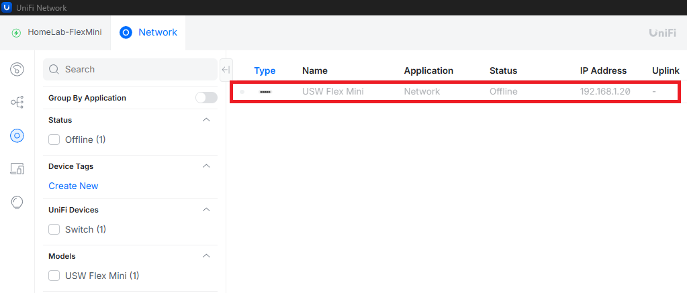
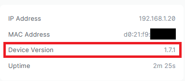

  
	

# Case Study: UniFi OS Controller Device Version Mismatch

This was one of those issues that looked like a network problem at first, but turned out to be something else entirely.

I was working with a USW Flex Mini running firmware 1.7.1, which is fairly old. My controller was UniFi OS Server on a much newer version. Everything seemed fine. The switch powered on, showed a steady white LED, responded to ping, and even appeared in the controller. But adoption kept failing or the device would go offline with no clear error.

---

That’s when I realized it might not be a connectivity issue. If everything at the network level was working, then something else had to be off.

The switch was on firmware 1.7.1, while the controller expected newer 2.x firmware. In simple terms, they could see each other, but they were not speaking the same language.

Interestingly, the device would only adopt successfully through the Network application, not UniFi OS Server. Even then, the firmware update failed within the application, which pointed even more strongly to a deeper compatibility issue.

After digging around, I came across a [Reddit thread](https://www.reddit.com/r/Ubiquiti/comments/18y67aq/new_usw_flex_mini_cant_update_past_171/) where someone ran into the exact same problem. Their solution was to manually update the switch using recovery mode.

At that point, I had two options. I could go through the recovery process and manually upgrade the firmware, or continue the lab as is.

For now, I decided to leave it as is so I could keep moving forward with the lab. I may come back to this later and document the recovery mode upgrade in a separate post.

The main takeaway for me was this. If a device shows up, has connectivity, but refuses to adopt without a clear reason, check the firmware version. Sometimes nothing is broken. It is just not compatible.